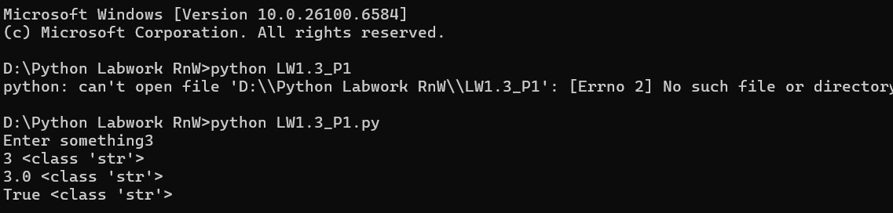

# First Python Project

## Description

This is my first Python project where I learned the fundamental concepts of Python programming. Through this project, I gained hands-on experience with core Python features that form the foundation of programming.

### Key Learnings

- **Print Function**: Learned how to display output to the console using the `print()` function
- **Variables**: Understanding how to store and manipulate data using variables
- **Data Types**: Explored different data types including integers, floats, strings, and booleans
- **End Parameter**: Discovered how to control the ending character of print statements using the `end` parameter
- **Sep Parameter**: Learned to customize separator characters between multiple values in print using the `sep` parameter
- **Type Function**: Used the `type()` function to identify the data type of variables
- **Operators**: Practiced arithmetic operators (+, -, *, /, //, %, **), comparison operators (==, !=, <, >, <=, >=), and logical operators (and, or, not)
- **Type Casting**: Converted data from one type to another using functions like `int()`, `float()`, `str()`, and `bool()`
- **Connectors**: Understood how to use logical connectors to combine multiple conditions

## Features

- ✅ Output display using print function
- ✅ Variable declaration and assignment
- ✅ Working with multiple data types (int, float, str, bool)
- ✅ Custom print formatting with end and sep parameters
- ✅ Type identification using type() function
- ✅ Mathematical operations with various operators
- ✅ Comparison and logical operations
- ✅ Data type conversion (type casting)
- ✅ Conditional logic using connectors

## Screenshot




## How to Run

1. Make sure Python is installed on your system
2. Save your Python file (e.g., `main.py`)
3. Open terminal/command prompt
4. Navigate to the project directory
5. Run the command:
   ```bash
   python main.py
   ```

## Author

Chirag Modi

## Date

6 January 2026